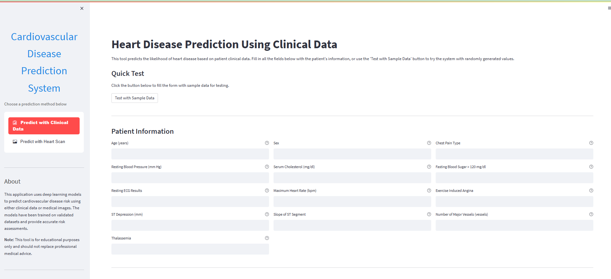
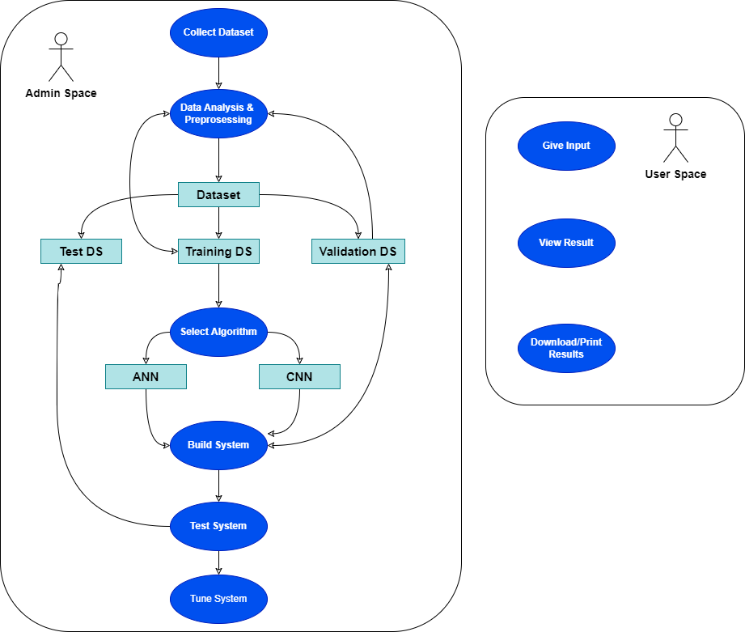

 # Cardiovascular Disease Prediction Project

This project aims to develop a deep learning model for predicting cardiovascular disease (CVD) by utilizing artificial neural networks (ANN) and convolutional neural networks (CNN) to analyze both structured and unstructured CVD-related data.




## 🔍 Research Questions

- Can we accurately predict the presence of cardiovascular disease based on given features?
- What are the most important features contributing towards CVD prediction?

## 📁 Project Structure

- `data` : Contains the datasets utilized throughout the project.
	+ `UCI ML Repository`
	+ `Mendeley Data`
- `docs` : Documentation files (e.g. PDF reports).
- `notebooks` : Jupyter Notebooks for exploratory data analysis, modeling, and visualization.
- `src` : Source code implementation (e.g. custom layers, optimizer classes, etc.).
- `presentation` : Slides summarizing key findings.
- `project_diagrams` : Architecture diagrams and flowcharts.

## 📊 Usage

### Exploratory Data Analysis & Model Prototyping
Navigate to the `notebooks` directory and execute the provided Jupyter Notebooks according to the recommended order mentioned within each subdirectory.

#### Steps
1. Perform initial EDA on raw datasets.
2. Clean and preprocess data.
3. Feature engineering and selection.
4. Develop baseline machine learning models (e.g. logistic regression, random forest, XGBoost, etc.) for comparison purposes.
5. Design and implement custom deep learning architectures (e.g. ANN, CNN, hybrid models).
6. Evaluate model performances through cross-validation and hyperparameter tuning.

### Production-Ready Implementation
Access the `src` directory containing source codes implementing custom layers, optimizer functions, and other required components during the deployment stage. You can modify these scripts depending on your infrastructure setup.

## 🌐 Additional Resources

- [NIH - National Heart, Lung, and Blood Institute](<https://www.nhlbi.nih.gov/>): General overview of heart health and various conditions affecting it.
- [CDC - Centers for Disease Control and Prevention](<https://www.cdc.gov/heartdisease/index.htm>): Statistics, causes, risk factors, prevention tips, and resources regarding heart disease.
- [Mayo Clinic - Cardiovascular Disease Definition](<https://www.mayoclinic.org/diseases-conditions/heart-disease/symptoms-causes/syc-20353118>): Comprehensive definition and explanation of cardiovascular diseases.

## Tech Stack

🚀 **Languages**
- Python

📊 **Data Analysis and Visualization**:
- Pandas
- Matplotlib
- Plotly
- Seaborn
- Bokeh

🤖 **Machine Learning and Deep Learning**:
- TensorFlow
- Keras
- PyTorch Lightning
- FastAI
- scikit-learn
- numpy
- tqdm

📚 **Other Tools and Frameworks**:
- ipynb: Jupyter Notebook format for reproducible research workflows
- nbconvert: Convert .ipynb files into multiple formats like HTML, LaTeX, PDF, Markdown, etc.

🔧 **Version Control**:
- Git: Collaborative version control system

💻 **Development Environment**:
- Google Colab: Free GPU-enabled environment supporting popular libraries out-of-box
- Visual Studio Code: Advanced text editor offering numerous extensions catered specifically towards ML/DL projects

## 🔧 Deployment

To deploy this project locally, follow these steps:

1. Clone the repository onto your local machine:
    ```bash
      git clone <https://github.com/YOUR_USERNAME/CV-Prediction-Project.git>
    ```

2. Change directories to navigate inside the cloned repo:
    ```bash
      cd CV-Prediction-Project
    ```

3. Install all dependencies specified in the `requirements.txt` file:
    ```bash
      pip install -r requirements.txt
    ```

4. Optionally create a virtual environment before running any commands if desired:
   ```bash
     conda env create --name cvd_env python==3.9
     conda activate cvd_env
   ```

5. Begin working on your chosen task within the appropriate directory.

## 📰 Project Report

For more comprehensive details on the study, results, and future recommendations, review the [Project Report](https://https://github.com/ZahirAhmadChaudhry/Cardiovascular-disease-prediction-using-deep-leaerning/Report/Ahmad-Zahir-FinalYearProjectDocument.pdf).

## 📄 License

This project is distributed under the terms set forth by the [MIT License](https://https://github.com/ZahirAhmadChaudhry/Cardiovascular-disease-prediction-using-deep-leaerning/blob/main/LICENSE).